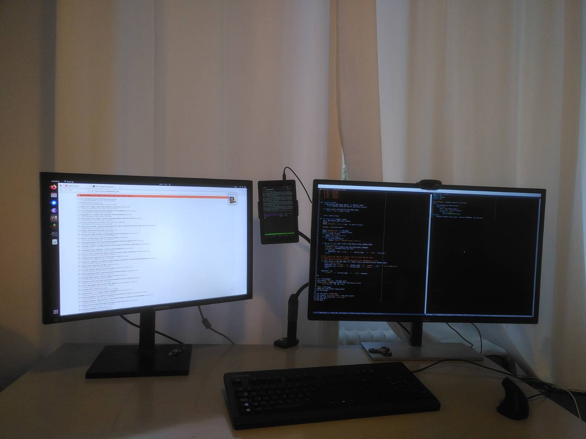
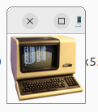
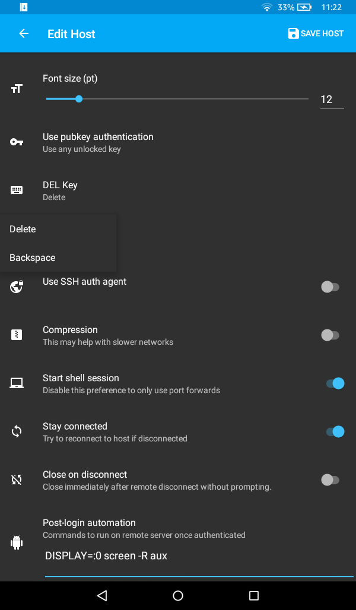

# Use an old tablet as an extra monitor

(as long as you want to use it as a terminal)



I have a couple old kindle fire tablets lying around. One of them has a battery
that lasts about ten minutes. I also never have enough screens and never know
where to put my terminal when I need to tail a log or something.

I tried using [Deskreen](https://github.com/pavlobu/deskreen) a long time ago
as my optional extra screen when I travel. I can't remember why I didn't get
that habit going.

For my extra office screen, I decided to do something different because
* My graphics card seems to be maxed out. I can't even use the internal screen.
* I don't know where I put that virtual display adapter.
* It seemed like a bit of a detour to send pixels to my tablet when I am only
looking at text

#### So what is then?

Well I just ssh into my computer from an android SSH client, open `screen`, and
then use a program I made that allows me to `stuff` the characters I type into
the screen session, so it feels like I am typing right into the tablet.



See if you can find this little window in the main picture. That is what I have
to activate using Alt+Tab to type into the terminal.

#### This is an 'MVP' and a 'POC' and stuff like that

While I think this approach to using a spare tablet as an extra screen may be
a winner, I am not so sure about this approach to this approach to using a
spare tablet as an extra screen.  Here are the issues:
* You have to give some a mobile app access to your entire computer. This seems
like a shame after the phone OS did all this work to sandbox the mobile app, and
not give it access to your phone or tablet. This is even less awesome for an
iPad since there don't seem to be any open source SSH clients, and even if
there were, I don't think there would be any guarantee that what you see on
github is what has been sent to the app store.
* You have to open an SSH server on your computer that exposes you to some
clever hacker in the Starbucks where you are using your spare screen
* I can't figure out how to stuff C-SPC, which is a 0x0 - so have a clunky
workaround
* It seems weird to execute `screen` once per key. I wish I could just pipe the
characters in or something - not that I have any idea how relevant that is to
performance.
* It's hard to find terminal clients for some old devices (like my iPad)

What I think might be a better approach to this approach is using a lot of the
bits and pieces in [hyper](https://hyper.is/), such as
[xterm.js](http://xtermjs.org/), showing the terminal in a web browser, and
sending the characters over a web socket. It would still only send just over a
byte per keypress or something like that, and not use your GPU/HDMI, but could
work on even more devices - any device with a browser, just like Deskreen. The
server app would have to do much more:
* serve the client app
* make you type in a four digita code that you see on your tablet screen sort of
like Bluetooth pairing
* set up the shell, and PTY probably
* listen to the console end of the PTY and send everything down the websocket
* send key presses to the PTY

Both solutions depend on the LAN, which is too bad. Maybe Web Bluetooth or
something for future old devices.

## Set-up

I don't really think anybody else should use my Python program that stuffs keys
into the screen session (unless it's an emergency).  You are better off taking
the idea and making your own even better solution. But I'll first explain it
using my program.

##### enable ssh on your computer

```
sudo apt-get install openssh-server
```

but make sure it is disabled so that you don't have it on unnecessarily, or in
public places.

```
sudo systemctl disable ssh
```

start it whenever you are playing with your extra screen and on a trusted
network:

```
sudo systemctl start ssh
```

disable it the rest of the time

```
sudo systemctl stop ssh
```

##### open a terminal/ssh client on your tablet

I side-loaded ConnectBot onto my Kindle Fire from F-Droid. I tried to sideload
F-Droid, and then install ConnectBot, but it failed for some reason

##### start screen with a known session name:

```
DISPLAY=:0 screen -R aux
```

If you are using ConnectBot on a Kindle Fire, there seems to be a
[known bug](https://github.com/connectbot/connectbot/issues/543) that return
doesn't work. There are some workarounds for emergencies in the bug report but
I just configured the above to happen every time I connected.

`DISPLAY=:0` makes it so that you can do stuff like `xdg-open .` and `emacs &`
and `git gui &` in the terminal, and see the result in your main gui session.



##### install and run my typing programme

Don't actually do this.

```
$ cd [project directory that you cloned]
$ make # to generate images and special null file
$ sudo apt-get install python3-gi
$ python3 start.sh aux
```

##### actually just make your own typing solution

Check this out:

```
$ screen -S aux -X stuff x
```

An `x` should appear in your terminal

You need to somehow make all the control characters work. The ones you need

```
infocmp screen
```

Look at [my program](./start.py) for ideas on how to implement yours that is
even better

There is some more debugging advice further down.

##### create a services or something

That would be cool to have the ssh daemon start the the typing program as a
service whenever the ssh session is opened - like similar to what you can do
with udev.

I think you have to do something with `ForceCommand` in `/etc/ssh/sshd_config`

I think you can also watch `/var/log/auth.log` for `sshd` and `Accepted` using
awk.

## FAQ

#### How well does it work?

It works really well on my Kindle Fire at the office as a terminal. It is too
slow at home, with my iPad, as my emacs screen. This could be because:
* the ssh client that I found that works with my old iPad is too slow to update
after characters get stuffed in
* the wifi network at home is too slow
* trying to use it as a full text editor for serious work makes the speed more
noticeable
(I have used emacs at the office set-up, in the picture, and it seems to work
pretty well, but it's too small to really try to work with it)

I am planning to mainly use it at the office to tail logs, but I have been
'daily driving' it for all terminal stuff just to try it out.

ConnectBot on Kindle Fire doesn't make it easy to get into landscape mode.
[Here](https://github.com/connectbot/connectbot/issues/868) it sounds like you
have to connect a Bluetooth keyboard. That's actually an interesting idea - I
could have made my type-into-the-terminal app act like a bluetooth keyboard for
your tablet instead of inserting characters into the screen session.

Originally, I had hoped for landscape, but now I have found a great for my
portrait tablet between my monitors, and found that for small terminal windows,
splitting across is good, and for logs, long is good. The text has to be quite
small to get 80 characters across.

I got used to finding the application with Alt+Tab. I tried to drag my mouse
over to the tablet a couple times. I don't really use workspaces. I like to be
able to see as many things as possible by turning my head, and find applications
to bring to the foreground with Alt+Tab. If you use workspaces, I guess it
changes things a little bit.  You could search for the terminal typing app, and
hide your other windows. On GNOME 3, or at least on Ubuntu 22.04, on my
computer, one of the screens never changes with workspace, so I guess the
terminal typing app could go in there. On MATE, both screens are in the
workspace, but I think there is an always in active workspace function
somewhere. Just brainstorming though - I am sure if a workspace user wants to
do the same thing, they'll work it out.

#### What about paste?

Ctrl+Shift+V for paste works by stuffing your whole clipboard into the screen
session.

#### What about copy?

I haven't figured out copy yet. I think there must be an easy way to send my
tmux clipboard to the graphical clipboard. Since I start `screen` with
`DISPLAY=:0`, any copy to clipboard utility should hopefully "just work".

#### Why do you use `screen` _and_ `tmux`?

* I didn't want all the tmux chrome when using emacs
(you can turn it off with tmux, but then that changes the tmux experience when
I do want to use tmux)
* I got the stuff command working with screen, and it's just a MVP/POC so I left
it like that.

#### If you are an emacs user, shouldn't you use one of the emacs shells?

Yeah I never really got into that, and I always have a full screen worth of
open text files.

#### Why don't you just use ____?

I have to admit, I didn't look to hard to see if there was a ready to go way to
do this - if somebody knows of one, please just submit a pull request that
deletes my whole repo, and leaves only a readme that points me toward the
alternative.

## Developing the typing application.

For developing, and getting the keycodes right, you don't really need a tablet.

I start a screen session in an ordinary terminal instead of the tablet, and
then run this program:

```
import sys
import termios
import tty

old_settings = termios.tcgetattr(sys.stdin)
try:
    tty.setraw(sys.stdin.fileno())
    while True:
        char = sys.stdin.read(1)
        print("%s\r" % hex(ord(char)))
        if char == '\x03':
            raise KeyboardInterrupt
finally:
    termios.tcsetattr(sys.stdin, termios.TCSADRAIN, old_settings)
```

Then I connect my python typer program to that screen session, and compare the
codes that I get when I type straight into the terminal to the codes I get when
I get when I use my typing application.

Hopefully after reading
[this](https://blog.nelhage.com/2009/12/a-brief-introduction-to-termios/) I
will understand more about what `tty.setraw` does.
